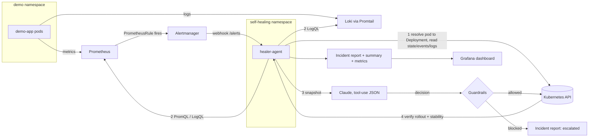

# Architecture

## Control loop (orchestrator.py)

1. **Ignore** alerts outside the namespace allowlist; resolve alert labels to a Deployment (pod -> ReplicaSet -> Deployment).
2. **Dedupe**: one in-flight incident per deployment; cooldown + hourly cap checked *before* spending an LLM call.
3. **Collect** deployment status, pod states, warning events, previous+current container logs, Loki history, CPU/memory/restart metrics.
4. **Decide**: Claude via forced tool call (`restart | rollback | scale_up | escalate`); deterministic rules if the LLM is unavailable.
5. **Guardrails** (code, not prompt): allowlist, opt-in label, confidence floor, cooldown, hourly cap, rollback needs a *distinct* earlier revision, scaling capped and refused when an HPA owns the deployment.
6. **Execute** via the Kubernetes API (rollback = JSON patch of the old pod template, same as `kubectl rollout undo`).
7. **Verify**: rollout complete, all pods Ready, no restarts, CPU below threshold for scale-ups, for N consecutive checks.
8. **Report**: timeline, root cause, action, outcome, LLM-written summary -> JSON + Markdown + `/incidents` + Prometheus counter.

## Threat model notes
- Logs are untrusted input to the LLM (prompt injection). The model can only choose from four actions and guardrails validate every choice; worst case is a wrong-but-bounded restart/rollback/scale inside an opted-in namespace.
- RBAC is namespaced `Role`s, not cluster-wide; the agent cannot delete anything or touch Secrets.
- Optional bearer token on the webhook (`HEALER_WEBHOOK_TOKEN`).
